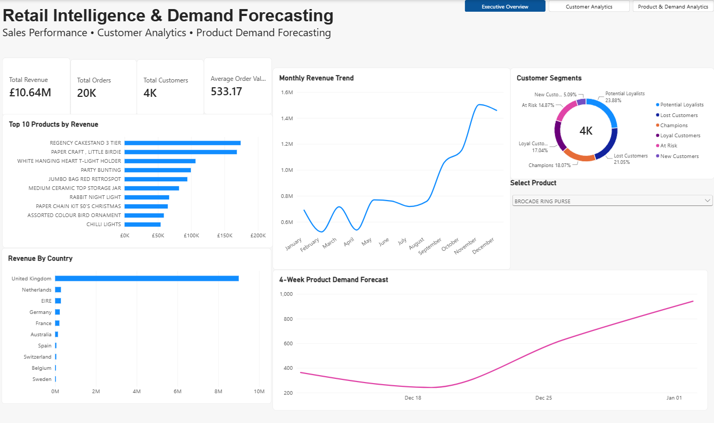
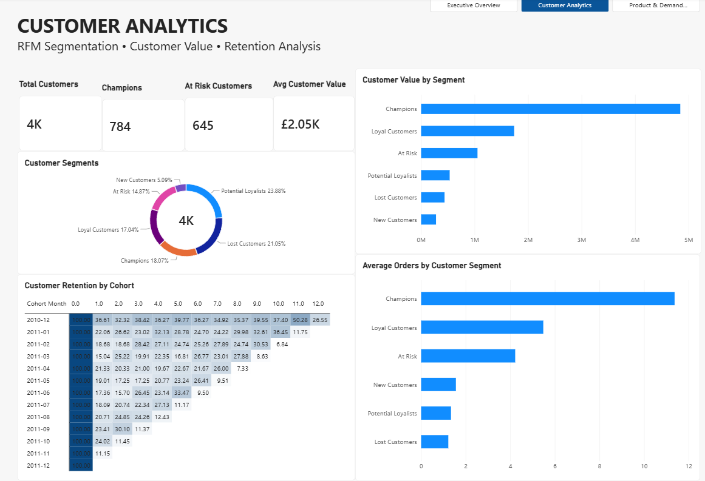
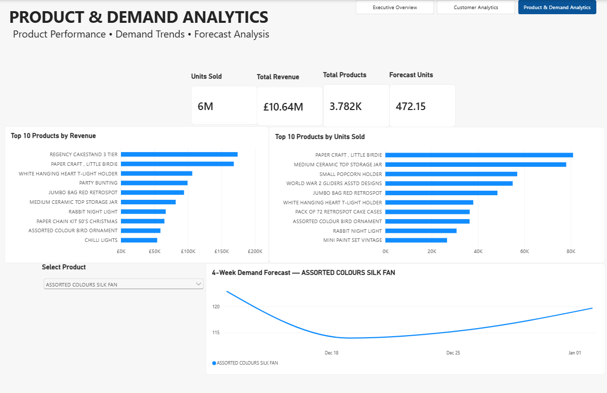

# Retail Intelligence & Demand Forecasting

End-to-end retail analytics and demand forecasting solution built with **Python, PostgreSQL, SQL, machine learning, and Power BI**.

The project transforms **536,641 retail transactions** into an analytics-ready PostgreSQL database, customer and product insights, and product-level demand forecasts using automated model evaluation.

---

## Dashboard Preview

### Executive Overview



### Customer Analytics



### Product & Demand Analytics



---

## Key Highlights

- Processed and loaded **536,641 retail transactions** into PostgreSQL
- Built reusable **SQL analytics views** for reporting and business analysis
- Developed **RFM customer segmentation**
- Performed **cohort retention analysis**
- Analyzed product, customer, country, and revenue performance
- Evaluated **Naive, 4-Week Moving Average, 8-Week Moving Average, and Random Forest** forecasting models
- Automatically selected the **lowest-MAE model for each product**
- Generated **4-week demand forecasts for 20 products**
- Loaded **80 forecast records** into PostgreSQL
- Built a **3-page interactive Power BI dashboard**
- Implemented **product-level report-page tooltips**
- Protected database credentials using environment variables and Git-safe configuration

---

## Project Overview

Retail businesses need to understand both historical performance and future demand.

This project builds an end-to-end analytics pipeline designed to answer business questions such as:

- Which products generate the most revenue?
- Which products sell the highest number of units?
- Which countries contribute the most revenue?
- Which customer segments generate the most value?
- Which customers are at risk of becoming inactive?
- How well are customers retained over time?
- What demand can be expected for selected products over the next four weeks?

The final analytical layer is presented through an interactive Power BI dashboard covering:

1. Executive performance
2. Customer analytics
3. Product performance and demand forecasting

---

## Tech Stack

### Programming & Data Processing

- Python
- pandas
- NumPy

### Machine Learning & Forecasting

- scikit-learn
- Random Forest
- Naive Forecasting
- Moving Average Models
- Mean Absolute Error (MAE)

### Database & Analytics

- PostgreSQL
- SQL
- SQLAlchemy
- psycopg2

### Business Intelligence

- Power BI
- DAX
- Power Query

### Development

- Git
- GitHub
- Visual Studio Code
- Python Virtual Environments

---

## Project Architecture

```text
Raw Retail Data
      |
      v
Python ETL & Data Cleaning
      |
      v
Processed Transaction Data
      |
      v
PostgreSQL Database
      |
      +----------------------+
      |                      |
      v                      v
SQL Analytics Views    Forecasting Pipeline
      |                      |
      |                Weekly Demand
      |                      |
      |                Model Evaluation
      |                      |
      |                Best Model Selection
      |                      |
      |                4-Week Forecasts
      |                      |
      +-----------+----------+
                  |
                  v
               Power BI
                  |
       +----------+----------+
       |          |          |
   Executive   Customer   Product &
    Overview   Analytics  Demand Analytics
```

---

## Power BI Dashboard

The reporting layer contains three interactive dashboard pages.

### 1. Executive Overview

Provides a high-level view of overall retail performance.

Key metrics and analyses include:

- Total Revenue
- Total Orders
- Total Customers
- Average Order Value
- Monthly Revenue Trend
- Top Products by Revenue
- Revenue by Country
- Customer Segment Distribution
- Product Demand Forecast

### 2. Customer Analytics

Provides deeper analysis of customer behavior, value, segmentation, and retention.

Key components include:

- Total Customers
- Champion Customers
- At-Risk Customers
- Average Customer Value
- RFM Customer Segmentation
- Customer Value by Segment
- Average Orders by Customer Segment
- Cohort Retention Analysis

### 3. Product & Demand Analytics

Connects historical product performance with forward-looking demand forecasting.

Key components include:

- Units Sold
- Total Revenue
- Total Products
- Forecast Units
- Top Products by Revenue
- Top Products by Units Sold
- Interactive Product Selection
- Four-Week Product Demand Forecast
- Product-Level Report-Page Tooltips

---

## Customer Segmentation

Customers are segmented using **RFM analysis**.

RFM represents:

- **Recency** — how recently a customer purchased
- **Frequency** — how frequently the customer purchases
- **Monetary Value** — how much revenue the customer generates

Customers are grouped into business-oriented segments:

- Champions
- Loyal Customers
- Potential Loyalists
- At Risk
- Lost Customers
- New Customers

This allows customer behavior to be analyzed beyond aggregate sales metrics.

---

## Cohort Retention Analysis

Customer retention is analyzed by grouping customers according to their first purchase month.

The cohort matrix tracks the percentage of customers who return during subsequent months.

This provides insight into:

- Customer retention behavior
- Repeat purchasing
- Long-term customer engagement
- Differences between acquisition cohorts

The resulting cohort retention matrix is visualized as a heatmap in Power BI.

---

## Demand Forecasting

The forecasting pipeline evaluates multiple forecasting approaches independently for each selected product.

### Models Evaluated

1. Naive Forecast
2. 4-Week Moving Average
3. 8-Week Moving Average
4. Random Forest

Forecast accuracy is evaluated using **Mean Absolute Error (MAE)**.

Rather than applying one forecasting model to every product, the pipeline automatically selects the model with the **lowest MAE for each individual product**.

---

## Model Selection Results

The evaluation of 20 forecastable products selected:

| Model | Products Selected |
|---|---:|
| Random Forest | 8 |
| Naive | 6 |
| Moving Average 4 | 3 |
| Moving Average 8 | 3 |

Different products can therefore use different forecasting approaches depending on their historical demand patterns.

The selected models are then used to generate four future weekly forecasts for each product.

---

## Forecasting Pipeline

```text
Historical Transactions
        |
        v
Weekly Product Demand
        |
        v
Select Forecastable Products
        |
        v
Evaluate Candidate Models
        |
        v
Compare MAE
        |
        v
Select Best Model per Product
        |
        v
Generate 4-Week Forecast
        |
        v
Save Forecast Results
        |
        v
Load Forecasts into PostgreSQL
        |
        v
Visualize in Power BI
```

The current pipeline evaluates **20 products** and generates **4 future weekly forecasts per product**, resulting in **80 forecast records**.

---

## Project Structure

```text
retail-intelligence/
│
├── data/
│   ├── raw/
│   │   └── .gitkeep
│   │
│   └── processed/
│       └── .gitkeep
│
├── powerbi/
│   ├── customer_analytics.png
│   ├── executive_overview.png
│   ├── product_and_demand_analytics.png
│   └── tool_tip_demo.png
│
├── sql/
│   ├── 01_create_schema.sql
│   ├── 02_analysis_queries.sql
│   └── 03_analytics_views.sql
│
├── src/
│   ├── config.py
│   ├── data_profile.py
│   ├── etl.py
│   ├── forecast.py
│   ├── forecast_products.py
│   ├── generate_forecasts.py
│   ├── load_database.py
│   └── load_forecasts.py
│
├── .env.example
├── .gitignore
├── README.md
└── requirements.txt
```

Large raw and processed datasets are excluded from Git to keep the repository lightweight.

---

# Local Setup

## 1. Clone the Repository

```bash
git clone https://github.com/TAMANGP2/retail-intelligence-demand-forecasting.git
cd retail-intelligence-demand-forecasting
```

---

## 2. Create a Python Virtual Environment

Python **3.10** is recommended.

### Windows

```powershell
py -3.10 -m venv .venv
```

Activate the environment:

```powershell
.\.venv\Scripts\Activate.ps1
```

---

## 3. Install Dependencies

```powershell
python -m pip install -r requirements.txt
```

---

## 4. Configure PostgreSQL

Create a PostgreSQL database named:

```text
retail_intelligence
```

Copy:

```text
.env.example
```

to:

```text
.env
```

Then configure your database credentials:

```env
DB_HOST=localhost
DB_PORT=5432
DB_NAME=retail_intelligence
DB_USER=postgres
DB_PASSWORD=your_password
```

The `.env` file is excluded from Git and should **never be committed**.

---

## 5. Create the Database Schema

Run:

```text
sql/01_create_schema.sql
```

against the `retail_intelligence` PostgreSQL database.

The SQL layer defines the database structures required by the analytics pipeline.

---

## 6. Prepare the Data

Place the source retail dataset in the appropriate raw-data directory and run the ETL pipeline as required.

The processed transaction dataset is generated as:

```text
data/processed/clean_transactions.csv
```

Raw and processed datasets are excluded from the public Git repository.

---

## 7. Load Transactions into PostgreSQL

```powershell
python -m src.load_database
```

The loader clears existing transaction records before inserting the processed dataset, preventing duplicate records when the command is rerun.

For the current dataset, successful verification produces:

```text
536,641 transactions
```

---

## 8. Evaluate Forecasting Models

```powershell
python -m src.forecast_products
```

The script evaluates the candidate forecasting models for each selected product and determines the best-performing model using MAE.

Evaluation results are saved locally to:

```text
data/processed/forecast_model_evaluation.csv
```

---

## 9. Generate Product Forecasts

```powershell
python -m src.generate_forecasts
```

The selected model for each product is used to generate four future weekly forecasts.

Forecasts are saved locally to:

```text
data/processed/product_demand_forecasts.csv
```

---

## 10. Load Forecasts into PostgreSQL

```powershell
python -m src.load_forecasts
```

The current pipeline loads:

```text
80 forecast rows
```

representing four forecast weeks for 20 products.

---

## Reproducing the Forecast Pipeline

Once PostgreSQL and the processed transaction data are ready, the main forecasting workflow can be reproduced with:

```powershell
python -m src.load_database
python -m src.forecast_products
python -m src.generate_forecasts
python -m src.load_forecasts
```

---

## Analytics Layer

Reusable SQL views provide an analytical layer between the transactional database and Power BI.

The analytics layer supports:

- Executive KPIs
- Monthly sales trends
- Country performance
- Product performance
- Customer RFM analysis
- Customer segmentation
- Cohort retention
- Forecast integration

This keeps business logic centralized rather than reproducing transformations separately across dashboard visuals.

---

## Repository Data Policy

The original retail dataset and generated processed CSV files are intentionally excluded from Git.

The repository contains `.gitkeep` files so that the required data directory structure remains available after cloning.

Excluded files include:

```text
data/raw/Online Retail.xlsx
data/processed/clean_transactions.csv
data/processed/forecast_model_evaluation.csv
data/processed/product_demand_forecasts.csv
```

Database credentials are also excluded through the `.env` file.

---

## Future Improvements

Potential extensions to the project include:

- Automated scheduled data refresh
- Additional time-series forecasting models
- Forecast confidence intervals
- Hyperparameter optimization
- Product category-level forecasting
- Customer churn prediction
- Automated model retraining
- Cloud database deployment
- Power BI Service deployment
- Pipeline orchestration

---

## Author

**Palden Tamang**

Computer Science | Data Analytics | Software Development

GitHub: **TAMANGP2**